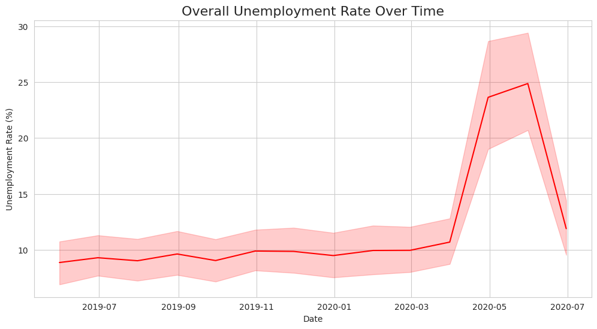
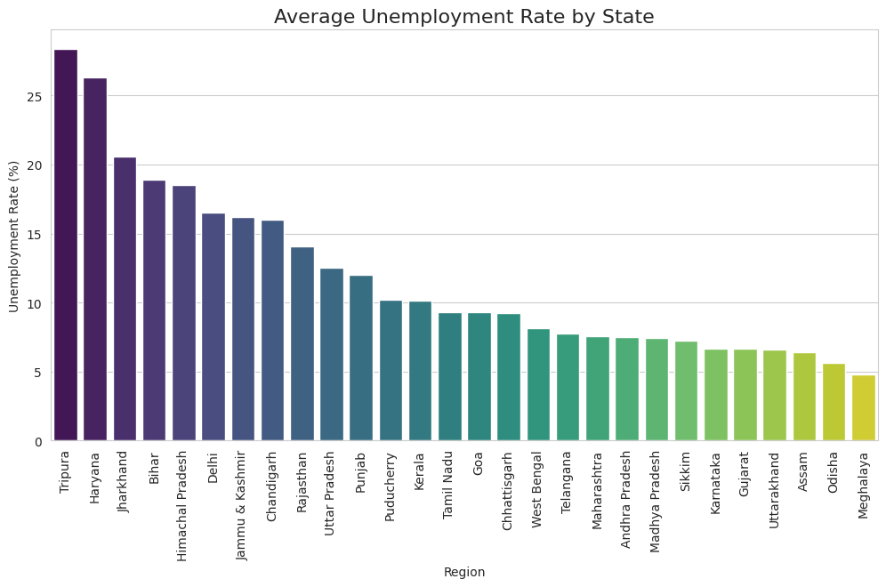
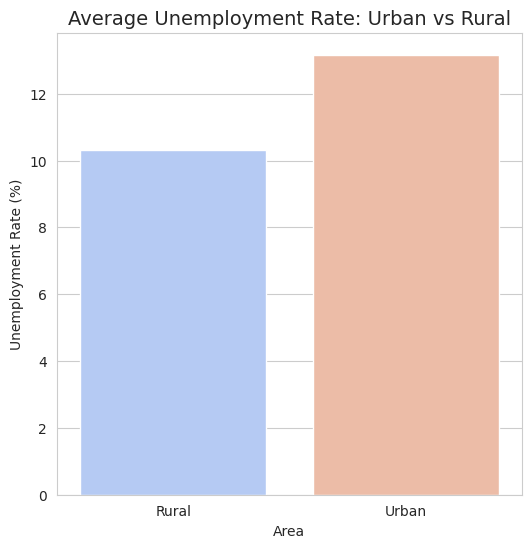
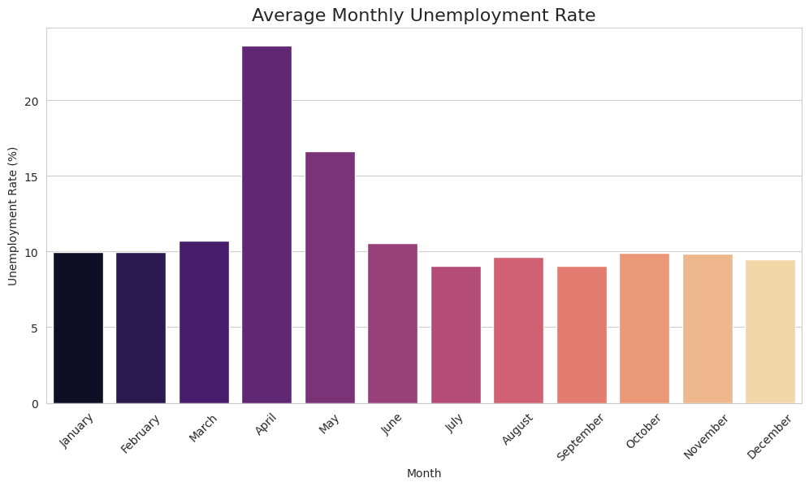
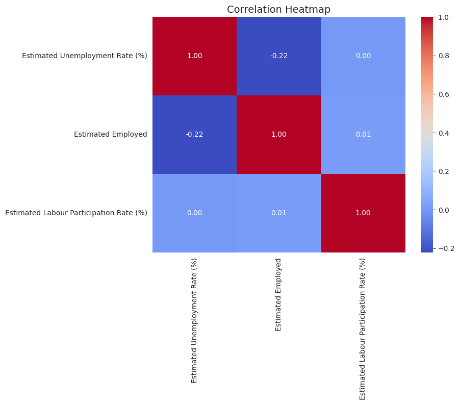

# 📊 Unemployment Analysis in India  

This project analyzes unemployment trends across Indian states using **CMIE data**.  
It covers **data cleaning**, **exploratory data analysis (EDA)**, and **visualizations** to reveal insights on rural vs. urban unemployment, time-based trends, and the COVID-19 impact.

---

## 📌 Project Overview  
- **Data Cleaning**: Handling missing values and inconsistent formats.  
- **EDA**: Identifying patterns in unemployment rates, employment numbers, and labour participation rates.  
- **Visualization**: State-wise comparisons, urban vs. rural breakdown, and correlation analysis.  

---

## 📂 Dataset  
**File:** `Unemployment_in_India.csv`  
**Columns:**  
- `Region` – State/UT name  
- `Date` – Month & year  
- `Frequency` – Data frequency (monthly)  
- `Estimated Unemployment Rate (%)`  
- `Estimated Employed`  
- `Estimated Labour Participation Rate (%)`  
- `Area` – Rural / Urban  

---

## 🛠 Tech Stack  
- **Python**  
- **Pandas**  
- **Matplotlib**  
- **Seaborn**  
- **Jupyter Notebook**  

---

## 📁 Repository Structure  
```
.
├── .gitignore
├── LICENSE
├── README.md
├── Unemployment_in_India.csv           # Raw dataset
├── unemployment_cleaned.csv            # Cleaned dataset
├── unemployment_analysis.ipynb         # Analysis notebook
├── requirements.txt                     # Dependencies
├── Correlation_Heatmap.png              # Correlation between features
├── Covid-19_Impact(2020).png            # COVID impact on unemployment
├── Overall_trend.png                    # Overall unemployment trends
├── State-wise_Average_Unemployment.png  # State-wise unemployment rates
├── Urban_vs_Rural_Unemployment.png      # Urban vs. rural comparison
└── _Monthly_Trends.png                  # Monthly unemployment trend
```

---

## 🚀 How to Run Locally  
1️⃣ Clone the repository  
```bash
git clone https://github.com/yourusername/Unemployment-Analysis-India.git
cd Unemployment-Analysis-India
```  

2️⃣ Install dependencies  
```bash
pip install -r requirements.txt
```  

3️⃣ Run Jupyter Notebook  
```bash
jupyter notebook unemployment_analysis.ipynb
```  

---

## 📷 Visualizations  

### 🔹 Overall Trend  
  

### 🔹 State-wise Average Unemployment  
  

### 🔹 Urban vs Rural Unemployment  
  

### 🔹 Monthly Trends  
  

### 🔹 COVID-19 Impact (2020)  
.png)  

### 🔹 Correlation Heatmap  
  

---

## 📌 Insights  

Clear spike in unemployment around May 2020 — visible COVID-19 impact.

Distinct seasonal patterns across months (monthly averages).

Some states (as visible in the state-wise plot) consistently record higher average unemployment.

Rural and Urban unemployment show different dynamics — useful for targeted policy ideas.

Correlation heatmap highlights relationships among numeric features (employment, unemployment rate, labour participation).

---

## 📜 License  
This project is licensed under the MIT License - see the [LICENSE](LICENSE) file for details.  
